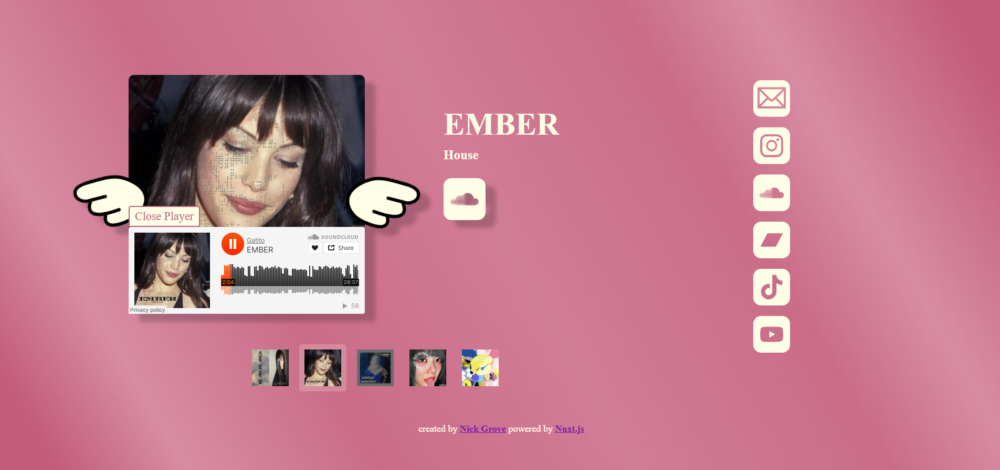

# djgatito.com



## Design Considerations

When I started designing this website for DJ Gatito I wanted to create a simple and seamless website that portrays her brand perfectly. The objective of the aesthetic choices was to depict dreaminess and cuteness, and to present the interface to the user as a living, breathing artifact. This is represented in many ways including the fluttering song artwork with its cartoon cupid wings, the pink metallic backdrop, the deep shadows, and the shades of cream and pink. Diversions from the main aesthetic in the form of social media link colors and the design of the open and close player buttons was intentional to allow the user to easily distinguish the technological utility of the website from the artistic details.

## Souncloud Integration

Souncloud's developer tools are integrated in two different ways in this project with a call to Soundcloud's API through the use of Netlify's serverless functions. This functionality is used to fetch DJ Gatito's 5 most recent songs:<br>
<br>
app.vue
```
    const response = await fetch(
        `/.netlify/functions/soundcloud?userId=${userId}&clientId=${clientId}&limit=7`
    )
```
<br>
netlify/functions/soundcloud.js

```
    export default async (req, context) => {
    const url = new URL(req.url)
    const userId = url.searchParams.get('userId')
    const clientId = url.searchParams.get('clientId')
    const limit = url.searchParams.get('limit') || 7

        try {
            const response = await fetch(
            `https://api-v2.soundcloud.com/users/${userId}/tracks?client_id=${clientId}&limit=${limit}`
            )

            if (!response.ok) {
            return new Response('Failed to fetch from SoundCloud', { status: response.status })
            }

            const data = await response.json()

            return new Response(JSON.stringify(data), {
            headers: {
                'Content-Type': 'application/json',
                'Access-Control-Allow-Origin': '*'
            }
            })
        } catch (error) {
            return new Response('Error fetching tracks', { status: 500 })
        }
    }
```
<br>
The other integration is with Soundcloud's Embed Player:<br>
<br>
components/Track.vue
```
    <div v-if="!isPlayerVisible" class="player-control-button" id="open-player" @click="openPlayer">Listen</div>
    <div v-if="isPlayerVisible" id="player-wrapper">
    <div class="player-control-button" id="close-player" @click="closePlayer">Close Player</div>
    <iframe
        id="player"
        width="100%"
        height="166"
        scrolling="no"
        frameborder="no"
        :src="`https://w.soundcloud.com/player/?url=${links.soundcloud}`">
    </iframe>
    </div>
```
